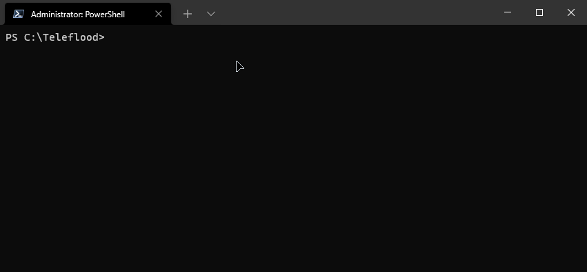

<h1 align="center">Teleflood - Telegram Flood Bot 
   
  </img>
</h1>

### An Telegram bot that for flooding to DMs/chats with multiple accounts and proxy support

# ⚠ Achtung

**This bot is used in purposes that are prehibited by Telegram terms of usage.  
Using this may result in banning your account(s) without ability to recovery it.**

## Contents

**1.** [Setting up](#setting-up)  
**2.** [Usage](#usage)

## Setting up

### What do you need:

**1.** Your Telegram credentials:

- Phone number
- Password (if you have 2FA)

**2.** API ID and API Hash (you can get it from [here](https://core.telegram.org/api/obtaining_api_id#obtaining-api-id))

### How to setup this bot:

**1.** Download this repository (using `git clone` or just click the big green button at the top of this page)  
**2.** Install [Python](https://www.python.org/downloads/) (you may need to restart your computer if you're using Windows)  
**3.** Open directory with bot using `cmd` (on Windows) or terminal (on Mac OS and Linux) and type the following command: `python -m pip install -r requirements.txt`
**3.** Create file with name `accounts.txt`  
**4.** Put your account credentials in it using following format:

- `phone:password:api_id:api_hash`
- `api_id` and `api_hash` is the lines you received in [What do you need](#what-do-you-need) second paragraph
- Example: `+19005553535:keyboardcat:133721:aiwjerlasidhoaw12312dlnawhiawd`
- You can find more advanced example with multiple accounts in `accounts.example.txt`

**5.** Rename file `config.example.txt` to `config.txt` and configure it using following info:

- `MESSAGE` is the message that will be sent while flooding
- `MESSAGE_COUNT` is the count of messages in total that will be sent to victim (if using multiple accounts, the messages will be split between each account)
- `VICTIM_ID` is the username/tag (not actual id unless you already flooded this victim) of user/chat you want to flood

#### After this, you are ready to go!

## Usage

### How to start this bot

**1.** Open directory with bot using `cmd` (on Windows) or terminal (on Mac OS and Linux)  
**2.** Type the following command: `python src/main.py`

- For more advanced users: if you want to get info about CLI, simply use the command `python src/main.py --help`
